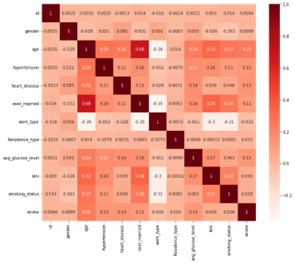

Anna Gardner (Report and Stroke Predictor), Emma Long (K-Means), Zhenming Liu (Data Preprocessing), Yawen Tan (GMM)

## Infographic

## Discover your risk of stroke




This prediction is based on a supervised machine learning model trained on data from the internet and should not replace medical advice from your doctor. 

## Introduction 
Strokes are one of the most common diseases. They affect the arteries within and leading to the brain. Globally, strokes are the second leading cause of death, accounting for approximately 11% of all deaths according to the World Health Organization (WHO). There are many factors that can be used to predict a patient's risk of stroke including high blood pressure, smoking, diabetes, high cholesterol levels, heavy drinking, high salt and fat diets, and lack of exercise. Most importantly, older people are more likely to suffer from a stroke than younger people. In addition, those who have already had a stroke are at greater risk of experiencing another. Therefore, our team aims to predict a patient's risk of stroke based on a robust dataset. We hope to create an interactive web component to display our results, and remind those who have high-risk health measurements to act preventatively and change their lifestyles to avoid stroke.

## Methodology 

### Original dataset

| Total Number of Patient | Total Number of Features  | Stroke or Not? |
| ----------------------- | ------------------------- | -------------- |
|           5110          |              11            |       Y/N      |

| Patient ID | Gender | Age | Hypertension | Heart Disease | Ever Married | Work Type | Residence Type | Average Glucose Level | BMI | Smoking Status |
| ---------- | ------ | --- | ------------ | ------------- | ------------ | --------- | -------------- | --------------------- | --- | -------------- |
|  67-72940  |   F/M  | 0-82|      Y/N     |      Y/N      |     Y/N      |     4     |  Urban/Rural   |         55-271        |10-97|        4       |

The stroke prediction dataset [1] will be used in this project. There are a total of 5110 rows (number of samples) and 12 columns with 11 features and one target column. The feature columns include physiological information believed to be relative to the chance of getting a stroke. The feature column contains integer values such as BMI and Glucose levels. It also contains string values such as Gender. It also contains boolean values such as known history of heart disease. The target value is a discrete value in which 0 corresponds to no stroke and 1 corresponds to a stroke. 

## Data Preprocessing
In order to prepare our data for both unsupervised and supervised analysis, we cleaned, standardized, reduced the dimensionality, and synthetically balanced our raw dataset. Some features in the raw data contain string values which are difficult for a machine learning algorithm to process. We converted these feature values into integer value with label encoding. For example, in the “gender” column, the “male” value is converted into 1, while the “female” value is 0.
We also observed that in our raw data had some missing values for BMI. Given that only 3.9% of this data was missing, we kept this feature and filled any missing values with the mean value of the data column. 
To better understand the features in the data after label encoding and filling in missing data, we plotted the correlation heat map shown in Figure 1. Features with very high correlation to each other and very low correlation to the target are subject to be dropped to reduce the overall dimensionality of our data.

Figure 1

Due to the low correlation value between the “id” and the target ”stroke” we dropped this feature.

After dropping the “id” feature, we performed SMOTE to balance the data. A major issue in the given dataset is that the raw data is unbalanced. 249 data points identify the chance of stroke, and 4821 data points identify no stroke given that stroke likelihood in the average patient is very low. In order to mitigate issues that arise from only 5% of our datapoints being from a patient who suffered from a stroke, we also rebalanced the dataset using the Synthetic Minority Oversampling Technique (SMOTE) [6]. This process choses samples with the same target value that is close in the feature space and drew new data points between these samples.
The balanced data oversamples at the adjacent of the minority (positive) datapoints to have the same number of data points as the majority (negative) data (Figure 2). We applied this method before performing PCA and T-SNE dimensionality reduction.

Figure 2

Both the PCA and T-SNE method was applied to further reduce the dimension of our data, into both 2D and into 3D, so that the data could be better visualized. We will extract the explained variance of the PCA method to understand the information we can retain after reducing the dimension.

 We implemented label coding to convert any string value to an integer value for better interpretation of the dataset. The target column is a 1-D array of boolean values indicating whether stroke risk is identified.  
Given that this dataset has only 11 features, it is not necessary to perform any dimensionality reduction for clustering analysis or our supervised learning approach. However, there were some missing data points in the BMI feature. These missing datapoints were replaced by the mean BMI of our dataset so as to minimally impact our outcomes. Additionally, the patient ID value is not relevant to stroke likelihood and was removed for our data analysis. Following all of this, we normalized our data using a standard scalar so that the encoded values of our data that was strings would not have a disproportionate impact on our results. This was all of the preprocessing done for our first round of unsupervised analysis. 
A major issue in the given dataset is that the raw data is unbalanced. 249 data points identify the chance of stroke, and 4821 data points have no stroke given that stroke likelihood in the average patient is very low. In order to mitigate issues that arise from only 5% of our datapoints being for a patient who suffered from a stroke, we also preprocessed the dataset using the synthetic minority oversampling technique (SMOTE) [6]. This increased the amount of datapoints that indicate stroke to 50% in our 'balanced' dataset.

In order to improve visualization ability of our cluster analysis for KMeans and Gaussian Mixture Modeling, however, we also implemented t-distributed stochastic neighbor embedding (T-SNE) to reduce the dimensionality of our features to 2 and 3 features. 

Unbalanced:

Balanced:

Unbalanced:

Balanced:

We also performed PCA in order to reduce the dimensionality to 2 and 3 dimensional spaces. We then performed a clustering analysis on these reduced datapoints as well.

Unbalanced:

Balanced:

Unbalanced:

Balanced:

The processed data was split into two segments, with 80%  for training and the remaining for testing.

## Methods
We analyzed the preprocessed dataset using two unsupervised clustering analysis approaches for expectation maximization. First we clustered using K-Means, and then with Gaussian Mixture Modeling (GMM).

## KMeans Clustering
We conducted the K-Means algorithm on both the original dataset and the dataset after T-SNE and PCA. The most important aspect of using this algorithm was to determine if the resulting clusters were useful for classifying specific attributes, in this case stroke risk, for specific groups of people.
The elbow method was used to determine the optimal number of clusters for the K-Means algorithm, which estimates the improvement for the addition of each cluster. Then we ran the K-Means algorithm for each of these optimal number of clusters.

## K-Means and GMM Results
Our data was preprocessed with 10 different combinations:
We performed the elbow method for GMM only on the balanced dataset of 10 features and used this number of clusters for the remaining preprocessed data:

### Unbalanced data (with label encoding, filled in missing data, and dropped patient id)
Elbow Method:

Optimal Clusters = 5

K-Means Cluster Evaluation:

### Balanced data (with label encoding, filled in missing data, and dropped patient id)
Elbow Method:

Optimal Clusters = 5

K-Means Cluster Evaluation:

GMM:

GMM Cluster Evaluation:

### 2D TSNE unbalanced data
Elbow Method:

Optimal Clusters = 5

K-Means:

K-Means Cluster Evaluation:

GMM:

GMM Cluster Evaluation:

### 2D TSNE balanced data
Elbow Method:

Optimal Clusters = 5

K-Means:

K-Means Cluster Evaluation:

GMM:

GMM Cluster Evaluation:

### 3D TSNE unbalanced data
Elbow Method:

Optimal Clusters = 7

K-Means:

K-Means Cluster Evaluation:

GMM:

GMM Cluster Evaluation:

### 3D TSNE balanced data
Elbow Method:

Optimal Clusters = 7

K-Means:

K-Means Cluster Evaluation:

GMM:

GMM Cluster Evaluation:

### 2D PCA unbalanced data
Elbow Method:

Optimal Clusters = 5

K-Means:

K-Means Cluster Evaluation:

GMM:

GMM Cluster Evaluation:

### 2D PCA balanced data
Elbow Method:

Optimal Clusters = 5

K-Means:

K-Means Cluster Evaluation:

GMM:

GMM Cluster Evaluation:

### 3D PCA unbalanced data
Elbow Method:

Optimal Clusters = 5

K-Means:

K-Means Cluster Evaluation:

GMM:

GMM Cluster Evaluation:

### 3D PCA balanced data
Elbow Method:

Optimal Clusters = 7

K-Means:

K-Means Cluster Evaluation:

GMM:

GMM Cluster Evaluation:

## Supervised Learning
Common supervised algorithms used for stroke prediction include Decision Tree, Voting Classifier[2], and Random Forecast, Logistic Regression [3]. Throughout this project, we will construct alternative models based on the above algorithms and compare the accuracy and precision of each method. We will also measure and visualize the statistical relationships between each standalone feature and stroke likelihood.

## Results
The expected outcome of our dataset stochastic neighbor embedding is that there will exist clusters of similar patient datapoints. These clusters represent patients who have similar health feature values. Given these similarities, one or more of these clusters may represent patients with high risk of stroke. The expected relationship between health features and stroke likelihood is expected to reflect known stroke risk factors including age, diabetes, and hypertension [5].
Additionally, the expected outcome of a supervised algorithm for stroke predicion is a binary classification and prediction of the data point's stroke value. Given the relatively small size of the dataset and the need for synthetic minority data creation, we aim for an accuracy of 80% for our test data. 

## Discussion
Reaching a prediction accuracy of over 80% for stroke risk would mean that from a simple set of health measurements this model can identify a person at high risk for stroke. This model would then be able to identify which individuals should take preventative measures for strokes. 
Additionally, with a trained supervised model of high accuracy stroke prediction, we aim to create a stroke risk calculator which can non-medically predict the likelikood of patient stroke. 

## References
[1]“Stroke prediction dataset,” [Online]. Available: https://www.kaggle.com/fedesoriano/stroke-prediction-dataset.  

[2] Tahia Tazin, Md Nur Alam, Nahian Nakiba Dola, Mohammad Sajibul Bari, Sami Bourouis, Mohammad Monirujjaman Khan, "Stroke Disease Detection and Prediction Using Robust Learning Approaches", Journal of Healthcare Engineering, vol. 2021, Article ID 7633381, 12 pages, 2021. https://doi.org/10.1155/2021/7633381.  

[3] JoonNyung Heo, Jihoon Yoon, Hyungjong Park, Young Kim, Hyo Suk Nam, Ji Hoe Heo. "Machine Learning–Based Model for Prediction of Outcomes in Acute Stroke". Stroke. 50. 1263–1265, 2019 http://doi.org/10.1161/STROKEAHA.118.024293.  

[4] Yew, Kenneth S, and Eric Cheng. “Acute stroke diagnosis.” American family physician vol. 80,1 (2009): 33-40. http://www.ncbi.nlm.nih.gov/pmc/articles/pmc2722757/  

[5] Boehme, Amelia K et al. “Stroke Risk Factors, Genetics, and Prevention.” Circulation research vol. 120,3 (2017): 472-495. doi:10.1161/CIRCRESAHA.116.308398

[6] Chawla, Nitesh & Bowyer, Kevin & Hall, Lawrence & Kegelmeyer, W.. (2002). SMOTE: Synthetic Minority Over-sampling Technique. J. Artif. Intell. Res. (JAIR). 16. 321-357. 10.1613/jair.953. 
