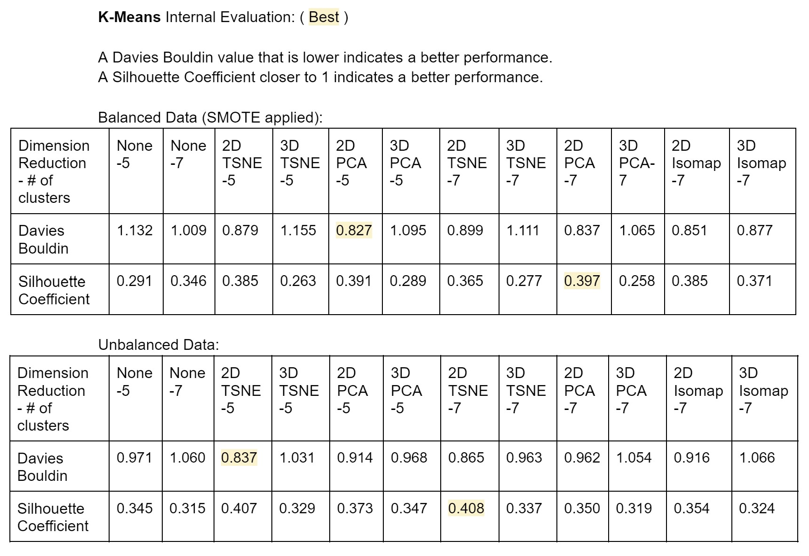

Anna Gardner (Report and Stroke Predictor), Emma Long (K-Means), Zhenming Liu (Data Preprocessing), Yawen Tan (GMM)

## Infographic

## Discover your risk of stroke




This prediction is based on a supervised machine learning model trained on data from the internet and should not replace medical advice from your doctor. 
The model used is a Support Vector Machine (SVM) with a Radial Basis Kernel. Based on our dataset of over 5,000 patients, this model had an accuracy of 95% for stroke prediction.  

## Introduction 
Strokes are one of the most common diseases. They affect the arteries within and leading to the brain. Globally, strokes are the second leading cause of death, accounting for approximately 11% of all deaths according to the World Health Organization (WHO). There are many factors that can be used to predict a patient's risk of stroke including high blood pressure, smoking, diabetes, high cholesterol levels, heavy drinking, high salt and fat diets, and lack of exercise. Most importantly, older people are more likely to suffer from a stroke than younger people. In addition, those who have already had a stroke are at greater risk of experiencing another. Therefore, our team aims to predict a patient's risk of stroke based on a robust dataset. We hope to create an interactive web component to display our results, and remind those who have high-risk health measurements to act preventatively and change their lifestyles to avoid stroke.

## Methodology 

### Original dataset

| Total Number of Patients | Total Number of Features  | Stroke or Not? |
| ----------------------- | ------------------------- | -------------- |
|           5110          |              11            |       Y/N      |

| Patient ID | Gender | Age | Hypertension | Heart Disease | Ever Married | Work Type | Residence Type | Average Glucose Level | BMI | Smoking Status |
| ---------- | ------ | --- | ------------ | ------------- | ------------ | --------- | -------------- | --------------------- | --- | -------------- |
|  67-72940  |   F/M  | 0-82|      Y/N     |      Y/N      |     Y/N      |     4     |  Urban/Rural   |         55-271        |10-97|        4       |

The stroke prediction dataset [1] will be used in this project. There are a total of 5110 rows (number of samples) and 12 columns with 11 features and one target column. The feature columns include physiological information believed to be relative to the chance of getting a stroke. The feature column contains integer values such as BMI and Glucose levels. It also contains string values such as Gender. It also contains boolean values such as known history of heart disease. The target value is a discrete value in which 0 corresponds to no stroke and 1 corresponds to a stroke. 

### Data Preprocessing
In order to prepare our data for both unsupervised and supervised analysis, we cleaned, standardized, reduced the dimensionality, and synthetically balanced our raw dataset. Some features in the raw data contain string values which are difficult for a machine learning algorithm to process. We converted these feature values into integer value with label encoding. For example, in the “gender” column, the “male” value is converted into 1, while the “female” value is 0.
We also observed that in our raw data had some missing values for BMI. Given that only 3.9% of this data was missing, we kept this feature and filled any missing values with the mean value of the data column. 
To better understand the features in the data after label encoding and filling in missing data, we plotted the correlation heat map shown in Figure 1. Features with very high correlation to each other and very low correlation to the target are subject to be dropped to reduce the overall dimensionality of our data. Due to the low correlation value between the “id” and the target ”stroke” we dropped this feature. There was also low correlation between "gender" and the target. Something to note is that we removed the "gender" column before the Isomap dimensionality reduction and all supervised learning but not before PCA or T-SNE due to time constraints. 

After dropping all unnecessary features, we performed SMOTE to balance the data. A major issue in the given dataset is that the raw data is unbalanced. 249 data points identify the chance of stroke, and 4821 data points identify no stroke given that stroke likelihood in the average patient is very low. In order to mitigate issues that arise from only 5% of our datapoints being from a patient who suffered from a stroke, we also rebalanced the dataset using the Synthetic Minority Oversampling Technique (SMOTE) [6]. This process chooses samples with the same target value that are close to eachother in the feature space and selects new datapoints that exist on a line between them. The balanced data oversamples at the adjacent of the minority (positive) datapoints to have the same number of data points as the majority (negative) data (Figure 2 in results). We applied this method before performing PCA and T-SNE dimensionality reduction.
Following these steps, we normalized the data between 1 and -1 in order to ensure that certain variables of different units would not have a disproportionate effect on our unsupervised and supervised learning models.

### Unsupervised Learning

The PCA, T-SNE, and Isomap methods were applied to further reduce the dimensions of our data for both the balanced and unbalanced data, into both 2D and into 3D, so that the data could be better visualized. We extracted the explained variance of the PCA method to understand the information we retained after reducing the dimensions.
The processed data are visualized in 2D and 3D using both T-SNE methods (Figure 3 and 3.1 in results) and PCA (Figure 4 and 4.1 in results).
The explained variance of different (and cumulative) principle component indexes for PCA is plotted in Figure 5 in results.

Given that our data has many possible combinations of preprocessing as specified in data preprocessing section above, we ran two clustering algorithms, K-Means and Gaussian Mixture Modeling on these combinations to discover the approaches that were most effective in finding clusters. 
Additionally, we used the elbow method to determine the optimal number of clusters. The target of the original dataset has only values 1 and 0. This indicates that ideally our data would form two clusters, one indicating a positive and one indicating a negative target value. However, after using the elbow method to find the optimal number of clusters, 5 or 7 will generate a much better loss. Also, the results of our TSNE and PCA dimension reduction showed visibly that there were more than two clusters present for each of these dimension reductions. 

We then quantified which models performed must successfully by calculating the Davies Bouldin and Silhouette Coefficient internal cluster evaluation measures of the clustering results.
The possible combinations of data preprocessing are as follows:
1. Unbalanced data with label encoding, filled BMI data, dropped patient id, normalization
2. Balanced data with label encoding, filled BMI data, dropped patient id, normalization
3. Unbalanced, cleaned data with 2d TSNE
4. Balanced, cleaned data with 2d TSNE
5. Unbalanced, cleaned data with 2d PCA
6. Balanced, cleaned data with 2d PCA
7. Unbalanced, cleaned data with 3d TSNE
8. Balanced, cleaned data with 3d TSNE
9. Unbalanced, cleaned data with 3d PCA
10. Balanced, cleaned data with 3d PCA
11. Unbalanced, cleaned data with 2d Isomap
12. Balanced, cleaned data with 2d Isomap
13. Unbalanced, cleaned data with 3d Isomap
14. Balanced, cleaned data with 3d Isomap

We analyzed the preprocessed datasets using two unsupervised clustering analysis approaches for expectation maximization. First we clustered using K-Means, and then with Gaussian Mixture Modeling (GMM), and determined the optimal number of clusters using the elbow method.
Then we calculated the Davies Bouldin and Silhouette Coefficients for each of these clusters. 

### Supervised Learning

For the supervised learning portion of this project, our team trained a Neural Network, a Support Vector Machine (SVM), and a Random Forest Classifier on our stroke data. We chose these three approaches, especially the Support Vector Machine, given that the labels for this dataset are a single binary value (yes stroke, no stroke) and as such this is a binary classification problem. Neural Networks are specifically great for classification problems as well as support vector machines when it is a binary classification problem. The same also holds for a Random Forest Classifier which we additionally chose given that it could provide us with a feature importance. It is a major goal for our project to determine the most important risk factors for stroke.
The three supervised models for learning that we used predict target values based on the dataset need the dataset to be balanced in order to not skew predictions towards the oversampled part of the data. As discussed in the data preprocessing section, we used SMOTE to balance this data before running the supervised learning models. 
For the neural network, we trained networks with 3, 4, and 5 layers in order to make sure we were not overfitting our model. 
For the SVM, we trained using multiple types of kernels as well as using hard and soft SVM.
For the random forest classifier, we minimized the maximum depth while also maintaining recall in order to tune the hyperperameters but not overfit the data. The tree and feature importance were then visualized. 
Each of these models were trained on our data with extensive hyperperameter tuning. We also experienced issues with overfitting in all three models and as such continued to change hyperperameters as well as the test-train split proportions to make sure our results of the highest quality possible.
Given that this data is used to predict strokes, it is most important to correctly label and identify cases where the stroke risk is positive. In the case of disease risk, we do not want to miss any patients of high risk, even when that means more false positives. Therefore we used recall as the primary measure of the success for our models and to determine the best hyperperameters.

## Results

### Data Preprocessing

After label encoding and filling in missing BMI data, the correlation heatmap between features and targets is plotted and shown in Figure 1. Due to the expected low correlation value between the “id” and the target ”stroke” we dropped this feature.

Figure 1

After dropping the “id” feature, we performed SMOTE to balance the data. The original data contains 4861 negative cases and only 249 positive cases. The balanced data oversample at the adjacent of the minority (positive) data points to have the same number of data points as the majority (negative) data (Figure 2).

Figure 2

### Unsupervised Learning

The processed data are visualized in 2D and 3D using both T-SNE and PCA methods for balanced and unbalanced data in Figures 3 - 3.2 and 4 - 4.2. The red X represents a positive data point, while the green dot represents a negative data point.

Figure 3 - 2D visualized data using TSNE with balanced data

Figure 3.1 - 2D visualized data using TSNE with unbalanced data

Figure 3.2 - 3D visualized data using T-SNE with balanced data

Figure 4 - 2D visualized data using PCA with balanced data

Figure 4.1 - 2D visualized data using PCA with unbalanced data

Figure 4.2 - 3D visualized data using PCA with balanced data

The explained variance of different (and cumulative) principle component indexes is plotted in Figure 5.

Figure 5 - PCA Explained Variance

Given that we ran K-Means and GMM on more than a dozen different combinations of our data with both 5 and 7 clusters, we had many different possible results for our cluster analysis. 
The performance of these analyses given the Davies-Bouldin and Silhouette Coefficient for K-Means are shown below in Figure 6.

Figure 6

The performance of these analyses given the Davies-Bouldin and Silhouette Coefficient for GMM are shown below in Figure 7.

Figure 7

A low score for the Davies Bouldin analysis indicates a better performance while a score closer to 1 indicates a good Silhouette Coefficient. 
The best scores for each performance metric are highlighted in yellow. We included visualizations for some of the best performing clusters, along with other clusters of visual interest given that there is limited space in this report. Below are some of the results: 

### K-Means 3D TSNE, unbalanced data, 7 clusters

Elbow Method

### K-Means 2D PCA, balanced data, 5 clusters

Elbow Method

### GMM 2D PCA, unbalanced data, 5 clusters

Elbow Method

### GMM 2D TSNE, unbalanced data, 5 clusters

Elbow Method

### K-Means 3D Isomap, unbalanced data, 5 clusters

 
 ### Supervised Learning
 
 ### Neural Network
 

Figure 8

 

Figure 9 - 5 Layer Neural Network

 
 ### Random Forest
 
 ### Support Vector Machine
 

## Discussion

### Data Preprocessing

From the correlation heat map (Figure 2), we can see that almost all the features are fairly independent of each other, except for “ever_married” and “age” which agree and that reflects our intuition. Even so, the correlation between these two features is only 0.68, and as such we chose to keep both features. Looking at the last row of the correlation matrix, we see both the “id” and “gender” have a relatively low correlation with our target value “stroke.” The “id” stands for a random number given to each patient and intuitively is not relative to the chance of getting a stroke. Thus, this feature is dropped with confidence. Although gender also shows a statistically low correlation to target, we still decided to keep it and leave for further steps.

### Unsupervised Learning

In the PCA explained variance, we can see that to keep over 90% of the information, we need to maintain 9 dimensions from our 11 features. The success of clustering with 9 dimensions is very difficult to visualize. As such, we took multiple approaches to our clustering analysis to visualized both dimension reduced and full-dimension clustering results as well as with balanced and unbalanced data. By reducing to 3 dimensions with PCA, only 40% of data variance is maintained. It is clear in the data visualizations for the different targets are heavily overlapping, especially in 3D. This can be explained by the fact that our features have very little correlation and are also all important risk factors for stroke. Thus, by reducing dimensions, important information from certain features is lost. Despite this, the 2D PCA reduction does show visible areas where there is higher density of positive target values. Additionally, the 2D PCA also performed relatively well on internal measures for K-Means and GMM. This may indicate that the clusters from the 2D PCA reduction have a significance in relation to stroke risk. 
We also implemented isomap dimensionality reduction with the hope that it would have better performance than PCA and T-SNE. This algorithm is a non-linear approach as opposed to PCA, and so had the chance of performing better than these other approaches. 

Given the wide range of possible patients, there are many possible areas that the dataset may have a cluster, for example younger females that live in urban settings. These clusters may not necessarily indicate in a binary fashion that all of these individuals will have a stroke. Rather the clusters likely indicate a general stroke risk. Additionally, the results of the PCA and T-SNE dimensionality reduction showed that the positive target values were not necessarily focused in one cluster, but were more on a gradient in certain areas. 
Due to this reality, we decided to find the optimal number of clusters using the elbow method for K-Means and GMM. This is because it is likely that if certain clusters have significance in terms of stroke risk that it would fall on a spectrum.

Because we took the approach of using the optimal number of clusters with the elbow method, there was no ground truth with which to analyze the dataset. Thus, we used the Davies Bouldin and Silhouette Coefficient internal measures for our clustering algorithms since they do not require ground truth tables yet indicate the success of a clustering algorithm performance.

Using these performance metrics we can compare the performance of K-Means, GMM, TSNE, PCA and Isomap. There are no significant performance differences between the K-Means and GMM algorithms for almost any of the data processing approaches. The Davies Bouldin values range around .85-1.1 and the Silhouette Coefficient from .29-.4. This small amount of variation can be attributed to the fact that many of the other clusters have a somewhat arbitrary formation. For example, the GMM 2D PCA, unbalanced data, 5 clusters shown in results has clusters that just look like rectangles cut from a larger rectange. Given that the data itself does not have any distinct cluster formations, the clustering algorithm has just optimized based on the random starting centers and not necessarily to find good clusters within the data. It would normally be expected that the GMM clustering would work better on oddly-shaped clusters given that a gaussian distribution allows for the different shapes based on the covariance of the features. 

The first displayed result of our K-Means algorithm 'K-Means 3D TSNE, unbalanced data, 7 clusters' shows a distinct set of clusters that are identified and color coded with the K-Means algorithm. Despite these clear clusters, its performance metrics were not better than that of the 2d PCA clusters. This is likely because of the more spaced-out nature of the values in each cluster as compared to the big group of close data points from PCA. This makes the metrics values lower. Figure 3.2 also shows that these clusters do not necessarily correlate with the density of true target values. This is due to the fact that this data may have datapoints that are close in euclidean distance, but do not reflect individuals with similar risk of stroke. Because clustering is done without target values, the discovered clusters do not always reflect or have any connection to the target values at all. 

Overall, despite taking many approaches to dimensionality reduction and clustering, our results for the Davies Bouldin and Silhouette Coefficients for our clustering algorithms were not great. Our Silhouette Coefficients were closer to 0 than they were to 1, and our Davies Bouldin values were not close to zero. Due to the complexity of disease of our data, unsupervised learning may not be well suited to this particular dataset and target. This dataset and target are more of a classification problem, and as such are better suited for supervised learning which we will implement in the second portion of this project.

### Supervised Learning
In general, the supervised learning portion of this project was much more successful for stroke prediction. This is an expected outcome because our dataset is a binary classification and supervised learning models are often specifically for classification. It is also the case that our dataset has the appropriate labels and thus we are able to train and test with these labels which is the role of supervised learning. 

In implementing our Neural Network, we tried multiple combinations of activation functions as well as batch sizes and number of epochs. Our loss function was binary cross-entropy. Given the great results for the 5 layer neural network, our team also implemented a 4 and 3 layer network to ensure that the results were not a result of overfitting (figure 8). Additionally, accuracy and precision for these results remained then same even when raising the test-train split to 40% test data and 60% training data. These great results for the neural network of around 89% accuracy and a peak of 90% recall (figure 9) are not suprising as this is a binary classification problem. Neural networks are able to find complicated relationships between features and prediction. Of note, the variance of each feature in this dataset was quite evenly spread as we discovered in the PCA portion of this project. This means that there is a lot of information in each feature of the stroke prediction dataset. It is likely that many factors play into stroke risk and they may be interrelated in many ways which a neural network can discover through training multiple layers.   

The next supervised learning approach we used was SVM. A support vector machine is particularly suited to this stroke dataset because it is a linear or non-linear binary classifier. Given the many features for our data, we attempted multiple types of kernels for training our model. This includes a simple SVM, Polynomial of varying degrees, gaussian, sigmoid, and radial basis for both soft and hard SVM. 

Note for midpoint: Since the Professor suggested the Isomap dimension reduction approach during class on Wednesday, we did not have time to visualize how it performs with isolating the target values in 3D. This will be completed and discussed in the final report. 
Additionally, we have not yet evaluated if the individual clusters found with K-Means or GMM have any significance with stroke likelihood, but will attempt to find any correlation if it exists before the final report. 
 

## References
[1]“Stroke prediction dataset,” [Online]. Available: https://www.kaggle.com/fedesoriano/stroke-prediction-dataset.  

[2] Tahia Tazin, Md Nur Alam, Nahian Nakiba Dola, Mohammad Sajibul Bari, Sami Bourouis, Mohammad Monirujjaman Khan, "Stroke Disease Detection and Prediction Using Robust Learning Approaches", Journal of Healthcare Engineering, vol. 2021, Article ID 7633381, 12 pages, 2021. https://doi.org/10.1155/2021/7633381.  

[3] JoonNyung Heo, Jihoon Yoon, Hyungjong Park, Young Kim, Hyo Suk Nam, Ji Hoe Heo. "Machine Learning–Based Model for Prediction of Outcomes in Acute Stroke". Stroke. 50. 1263–1265, 2019 http://doi.org/10.1161/STROKEAHA.118.024293.  

[4] Yew, Kenneth S, and Eric Cheng. “Acute stroke diagnosis.” American family physician vol. 80,1 (2009): 33-40. http://www.ncbi.nlm.nih.gov/pmc/articles/pmc2722757/  

[5] Boehme, Amelia K et al. “Stroke Risk Factors, Genetics, and Prevention.” Circulation research vol. 120,3 (2017): 472-495. doi:10.1161/CIRCRESAHA.116.308398

[6] Chawla, Nitesh & Bowyer, Kevin & Hall, Lawrence & Kegelmeyer, W.. (2002). SMOTE: Synthetic Minority Over-sampling Technique. J. Artif. Intell. Res. (JAIR). 16. 321-357. 10.1613/jair.953. 
